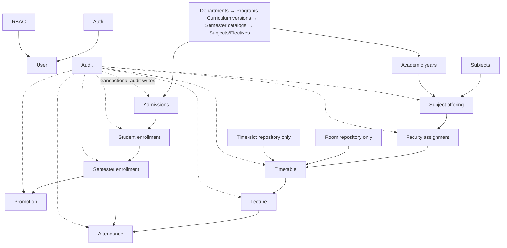

# Module dependency graph

## Verified functional graph

## Direct dependencies and boundaries

- Academic structure is shared infrastructure for admissions, enrollment, offerings, timetable, and lecture validation.
- Admission is a prerequisite for student enrollment; a student enrollment is a prerequisite for semester enrollment and promotion decisions.
- Timetable validates faculty assignment, subject offering/subject, room, and time slot; lecture snapshots scheduling relationships; attendance is attached to a lecture and semester enrollments.
- RBAC is a cross-cutting route dependency. Audit is a cross-cutting service dependency.

## Known problems

- `room` and `time-slot` are prerequisites without a public provisioning path.
- Subject offering and semester enrollment are intentionally authorized under parent resource names, weakening permission vocabulary and auditability of access policy.
- No circular imports were reported by configured ESLint, but the repository has no tests to exercise module integration.
