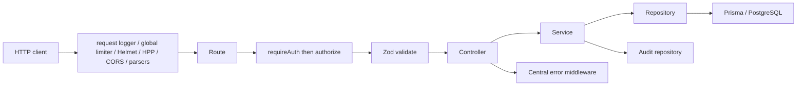

# Backend architecture

## Current implementation

The API is a modular monolith in `apps/api/src`. Each implemented domain generally has route, controller, service, repository, mapper, types, and Zod validation files. `app.ts` mounts route modules under `/api/v1`; controllers construct `ApiResponse`; services enforce cross-record rules and orchestrate interactive Prisma transactions; repositories own Prisma access. This direction is consistently visible in the route composition and repository comments, although auth audit operations are an exception (see below).

**Actual ordering caveat:** route-specific chains differ. Auth public routes use validation and (except refresh) an auth limiter. All non-auth mounted routers apply `requireAuth`, then per-handler `authorize`, then `validate`. Global middleware is installed before all routes in `app.ts`.

### Layer contract (observed)

| Layer      | Responsibility / allowed dependencies                                   | Observed boundary                                                                  |
| ---------- | ----------------------------------------------------------------------- | ---------------------------------------------------------------------------------- |
| Route      | Compose middleware and controller                                       | Thin; no Prisma/service calls found in route files                                 |
| Middleware | auth, authorization, validation, rate limits, request context, errors   | Auth only stores user/session claims; RBAC resolves current grants on each request |
| Controller | extract validated inputs, invoke service, build response                | Controllers are thin in inspected domains                                          |
| Service    | domain lifecycle, cross-model checks, transactions, audit orchestration | Most mutations use `prisma.$transaction` and `recordAuditTx`                       |
| Repository | Prisma query shape and transaction-client overloads                     | Centralizes queries; singleton used for reads                                      |
| Mapper     | maps models to DTOs                                                     | Avoids exposing password hashes in user/auth responses                             |

### Identity, authorization, errors, and observability

- Access JWTs include only `sub` and `sid`; `requireAuth` verifies signature/expiry and populates `req.user`. RBAC then resolves role assignments/permissions afresh, avoiding stale role claims.
- `authorize(resource, action)` resolves a permission key and scope authorization. Routes are permission-gated but services normally do not repeat object-level authorization.
- `ApiError` is converted by the global responder to `{ success: false, error: { message, code, requestId } }`; unknown errors are hidden from clients.
- Request context creates/validates `X-Request-ID`, logs completion metadata, and supplies audit request IDs through AsyncLocalStorage.

## Known problems

1. **Schema/API divergence:** models for future domains exist in the schema and migration, while only Phase-1 API modules are mounted. Treat them as persistence design, not available product capabilities.
2. **Rooms and time slots are persistence-only:** repositories exist, but no route/controller/service is mounted. Timetable creation requires their IDs, so records must currently be provisioned outside the API.
3. **No health route:** request logging has skip defaults for `/health` and `/healthz`, but `app.ts` defines neither.

## Recommended future improvements

- Establish import-boundary lint rules (routes → controller → service → repository) rather than comments alone.
- Add health/readiness endpoints and operational ownership for the Redis service, or remove unused development infrastructure.
- Define resource-specific RBAC permissions for semester enrollment and subject offering rather than reusing `student`/`subject`.
