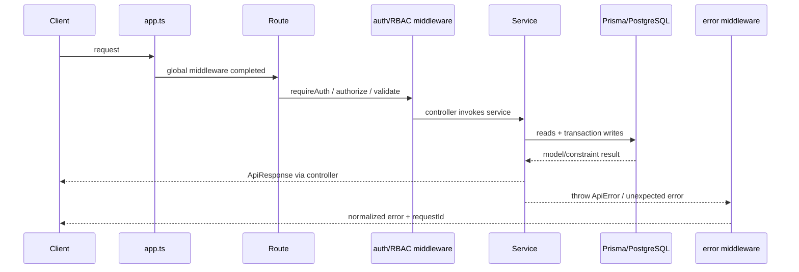

# Request lifecycle and error behavior

## Current implementation

1. `createServer()` configures proxy trust from `TRUST_PROXY`, request logging, global in-memory rate limiting, Helmet, HPP, CORS, 16 KiB JSON/urlencoded limits, cookie parsing, no-store cache headers, and compression.
2. A route applies auth/authorization/validation as applicable. Validation stores parsed values in `req.valid`; handlers should use that data rather than raw request payloads.
3. Controller calls service. Mutating Phase-1 services generally use an interactive transaction and `recordAuditTx` with its transaction client.
4. `ApiError` and uncaught errors reach `errorLoggerMiddleware` and `errorResponderMiddleware`. Prisma-specific mapping is invoked by controllers/services where they catch Prisma errors; the global handler itself does not call `mapPrismaError`.

## Representative traces

| Flow                   | Route and behavior                                                                                                                                                                                                                        |
| ---------------------- | ----------------------------------------------------------------------------------------------------------------------------------------------------------------------------------------------------------------------------------------- |
| Login                  | `POST /api/v1/auth/login` → auth limiter → Zod → service lookup, password verification, session + refresh row creation, access JWT, non-transactional login audit → controller sets refresh cookie and returns access token/user/session. |
| Academic resource      | `POST /api/v1/academic/departments` → auth → `department:create` → Zod → service transaction validates/audits/repository create.                                                                                                          |
| Admission cancellation | `POST /api/v1/admissions/:id/cancel` → auth → `admission:cancel` → service transaction re-reads admission, rejects cancelled/linked enrollment, updates status, transactionally audits.                                                   |
| Promotion finalization | `POST /api/v1/promotions/batches/:id/finalize` → auth → `promotion:finalize` → transaction validates all decisions, uses guarded batch finalization and updates lifecycle/term records plus audits.                                       |
| Attendance bulk mark   | `POST` bulk-mark route → auth → `attendance:create` → transaction checks OPEN session and enrollment eligibility, creates records, reads persisted set, audits.                                                                           |

## Known problems

- The global rate limiter uses the default in-memory store; it is not shared across processes.
- Rate-limit error response shape is `{success:false,message}` rather than the centralized `{success:false,error:{...}}` shape.
- Refresh is public and skips the stricter auth limiter (it remains under the global limiter).

## Recommended future improvements

Use a shared rate-limit store, normalize its error response through the standard error format, and add integration tests for all middleware ordering and error forms.
