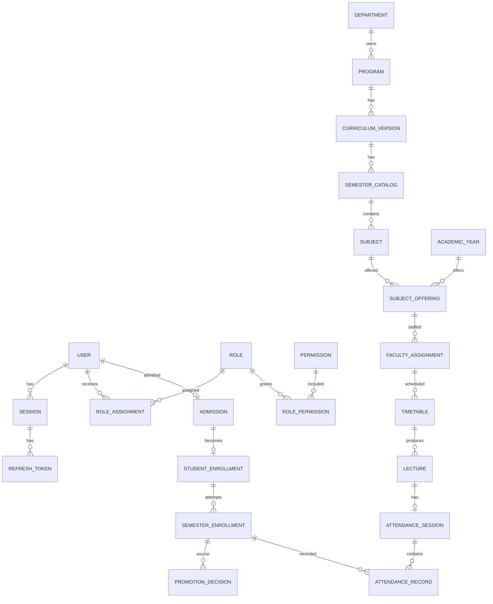

# Database architecture and logical ERD

## Current implementation

`packages/database/prisma/schema.prisma` is the Prisma source; one migration, `20260918060816_finilize_db`, creates the current PostgreSQL baseline. UUID-like string primary keys are Prisma defaults. Most mutable models have `createdAt`/`updatedAt`; audit logs are append-only by application convention and only have `createdAt`.

## Model catalog

- **Identity/RBAC:** User, Role, Permission, RolePermission, RoleAssignment, Session, RefreshToken, VerificationToken.
- **Academic/lifecycle:** Department, Program, CurriculumVersion, SemesterCatalog, AcademicYear, Admission, StudentEnrollment, SemesterEnrollment, PromotionBatch, PromotionDecision.
- **Delivery:** Subject, ElectiveGroup, StudentElectiveSelection, SubjectComponent, SubjectOffering, FacultyAssignment, Room, TimeSlot, Timetable, Lecture, AttendanceSession, AttendanceRecord.
- **Schema-only future domains:** Assignment, AssignmentSubmission, StudyMaterial, Notice, NoticeAudience, Notification, NotificationRecipient, CalendarEvent, Document, AuditLog, SystemSetting. Only AuditLog has an application module.

## Known problems

The single migration and schema are broadly aligned by model names and enums, but migration status still requires a reachable database to verify. Polymorphic scope/owner references (`RoleAssignment.scopeId`, notice audiences, documents) cannot be FKs and depend on services; future-domain services are absent.

## Recommended future improvements

Maintain an automatically generated schema reference/ERD in CI and introduce service-level validation before enabling polymorphic future-domain APIs.
