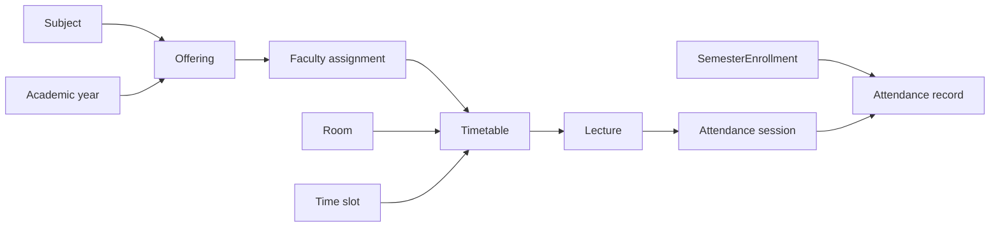

# Offerings, scheduling, lectures, and attendance

## Current implementation

| Module             | Responsibility and database model                                                              | API/RBAC                                                |
| ------------------ | ---------------------------------------------------------------------------------------------- | ------------------------------------------------------- |
| Subject offering   | Offers a subject for an academic year; unique `(subjectId, academicYearId)`                    | create/read; currently `subject:create/read`            |
| Faculty assignment | Assigns a faculty user to a subject offering component; unique pair                            | create/read; `facultyAssignment:create/read`            |
| Rooms/time slots   | Repository lookup support for scheduling                                                       | no route/service/controller mounted                     |
| Timetable          | Recurring weekly scheduling record; links offering/catalog/year/component/assignment/slot/room | create/read; `timetable:create/read`                    |
| Lecture            | Dated occurrence snapshots timetable-related relationships; `SCHEDULED/COMPLETED/CANCELLED`    | create/read/lifecycle routes; `lecture:*`               |
| Attendance         | one session per lecture (`OPEN/LOCKED`), records unique per session/enrollment                 | session, bulk mark, correct, lock, read; `attendance:*` |

All mutating services use interactive transactions and `recordAuditTx`. Timetable creation resolves all referenced records in its transaction. Lecture verifies timetable context/date/assignment rules. Attendance verifies lecture and enrollment eligibility before creating records, rejects locked sessions, and uses guarded status changes when locking.

## Concurrency and constraints

The database supplies unique constraints for offering, assignment, lecture natural key, attendance session-per-lecture, and attendance record-per-session/enrollment. These protect duplicate creation. Timetable conflict policy is implemented by service lookup/validation plus standard indexes; no exclusion constraint was found in migration SQL, so overlapping room/faculty schedules are not universally database-enforced.

## Known problems

- Room and time-slot records are required inputs but cannot be created or managed through this API.
- Attendance bulk marking loops over supplied enrollments and performs per-record relation checks. This is correct-oriented but can create high query counts for large classes.
- Scheduling conflict invariants lack a PostgreSQL exclusion/unique constraint and have no concurrency test; two simultaneous requests can pass a precheck if their conflict condition is only service-observed.

## Recommended future improvements

Expose protected catalog administration for rooms/time slots; add batch eligibility queries for attendance; use an appropriate database-level exclusion strategy (or explicit locking/serialization) for timetable overlap rules; add concurrency integration tests.
