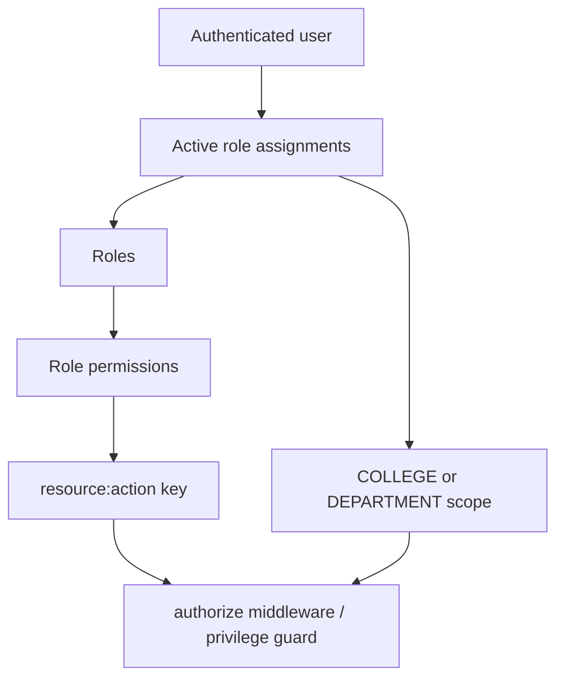

# Identity, users, RBAC, and audit

## Auth

**Purpose and API.** `auth.routes.ts` exposes public login/refresh/activation/password reset endpoints and authenticated logout/session endpoints. Passwords use Argon2 parameters from validated environment variables; the repository normalizes email. Access JWT lifetime is 15 minutes and refresh/session lifetimes are defined in `auth.constants.ts`; refresh tokens are random opaque values stored only as SHA-256 hashes. The controller puts refresh tokens in an HTTP-only cookie and returns access token metadata.

**Lifecycle.** Login verifies a real or dummy hash (reducing unknown-email timing signal), enforces user status, increments failures, locks after configured threshold, creates session and refresh row, then writes a best-effort audit. Refresh verifies hash, active session, expiry, revokes the presented refresh token and creates a replacement. Logout revokes the session. Password reset marks verification token used and revokes sessions.

**Known problems.** Login/session/refresh/audit writes are not one transaction. The rotation implementation reads an active token and only later revokes it; concurrent requests can both pass the check and issue separate valid refresh-token pairs. Password-reset request generates a token but deliberately has no email/job delivery implementation, so an external caller cannot receive the token through the current backend.

## Users

`user.routes.ts` has authentication-only `GET/PATCH /me` and RBAC-protected admin create/list/read/update/archive/restore routes. User mappers avoid returning password hash. User lifecycle operations use transactions and transactional audit writes. User self-service is intentionally not RBAC-gated; authorization is identity-based (`req.user.id`) and needs integration tests.

## RBAC

`authorization.middleware.ts` receives a literal resource/action, asks authorization service/permission resolver for the key, and resolves user assignments/scopes. Roles, permissions, and assignments have CRUD-like APIs and bootstrap/seed scripts. Permission catalog is source-controlled; roles/permission rows are persisted. Scope types are only `COLLEGE` and `DEPARTMENT`; polymorphic `scopeId` validation is necessarily service-level.

**Known problems.** Authorization is principally endpoint-level. Services do not consistently accept a target scope or independently prove object ownership, so any future route that uses a broadly scoped permission must deliberately add object-level checks. Semester enrollment uses `student:*`; subject offering uses `subject:*` because dedicated resources do not exist.

## Audit

`recordAuditTx(tx, input)` inserts in the business transaction and is used by most Phase-1 domain mutations. `recordAudit(input)` catches/logs failures and is used for auth events such as login/logout; consequently those audit events may be absent despite a successful operation. Audit rows contain actor/entity/action, old/new JSON, request ID/IP/user agent where supplied. Audit routes are not exposed.

**Known problem:** PostgreSQL does not prevent UPDATE/DELETE of `audit_logs`; comments explicitly say append-only enforcement needs separate runtime/migration roles.

## Recommended future improvements

Make refresh rotation an atomic guarded update or serializable transaction; make critical auth audits transactional/outbox-backed; introduce resource-specific enrollment/offering permissions; enforce audit append-only through runtime DB privileges; test scope and self-service object authorization.
