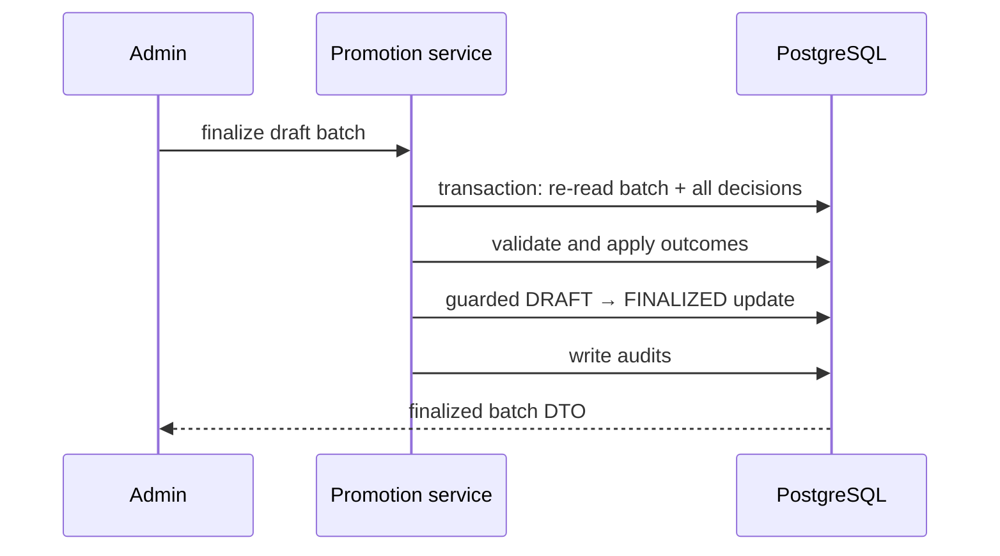

# Admissions, enrollment, and promotion

## Admission

`Admission` records a confirmed/cancelled entry against a user, program, curriculum version, and entry semester catalog. Create checks the referenced hierarchy and duplicate admission before transactional insert/audit. Update is limited to confirmed records. Cancel is a domain command: it rejects an already-cancelled admission and rejects cancellation once a student enrollment references it.

## Student and semester enrollment

A `StudentEnrollment` is a historical record tied one-to-one to admission and has roll-number uniqueness. Services allow create/update/cancel/withdraw, disallow physical delete, and transactionally audit mutations. A `SemesterEnrollment` links a student enrollment, semester catalog, academic year, status, and attempt number. It is create/read only; promotion owns later state changes. The database unique key `(studentEnrollmentId, semesterCatalogId, attemptNumber)` prevents duplicate attempts, while service code assigns the next attempt number.

## Promotion

A promotion batch is `DRAFT` or `FINALIZED`. Decisions have outcomes `PROMOTE`, `REPEAT`, `WITHDRAW`, `DISCONTINUE`, `GRADUATE`. Finalization loads all decisions without pagination, validates source enrollment/batch status/target contexts, applies per-outcome lifecycle changes and target enrollment creation as applicable, then uses a guarded finalization update and audit writes in one transaction.

## Dependencies and authorization

Admission uses `admission:*`; student and semester enrollment use `student:*`; promotion uses `promotion:create/read/finalize`. All routes authenticate and Zod-validate. Mappers return DTOs rather than raw models.

## Known problems

- Semester attempt allocation is a read-next-number-create sequence. The unique constraint prevents identical attempt numbers, but a concurrent collision becomes a generic uniqueness conflict rather than a reliable retry/domain result.
- The critical lifecycle graph has no tests for cancellation after references, promotion outcome combinations, finalization retry, or transaction rollback.

## Recommended future improvements

Use guarded/retryable allocation for attempt numbers, add idempotency/concurrency tests for finalization, and give semester enrollment a dedicated RBAC resource when policy needs separate delegation.
