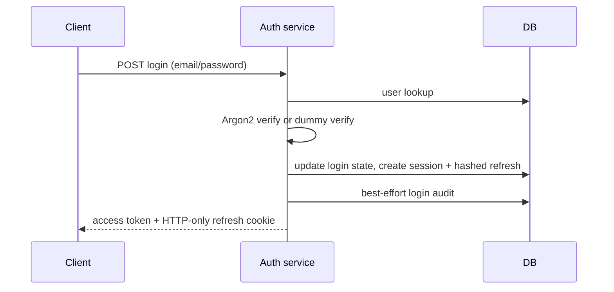
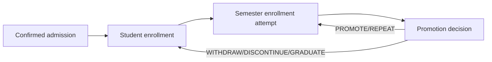
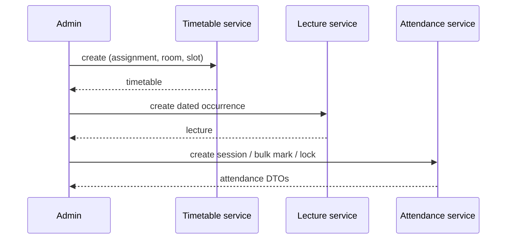

# Critical backend workflows

## Authentication

**Known issue:** login/session/audit is not atomic; refresh rotation has SEC-001 race.

## Student lifecycle

Each write uses a transaction/audit in the relevant service. Admission cancellation is rejected once enrollment exists. Promotion, not semester enrollment routes, owns subsequent term transitions.

## Scheduling and attendance

All of these Phase-1 mutations are transactional and audited. Room/time-slot setup is not exposed by the API.
